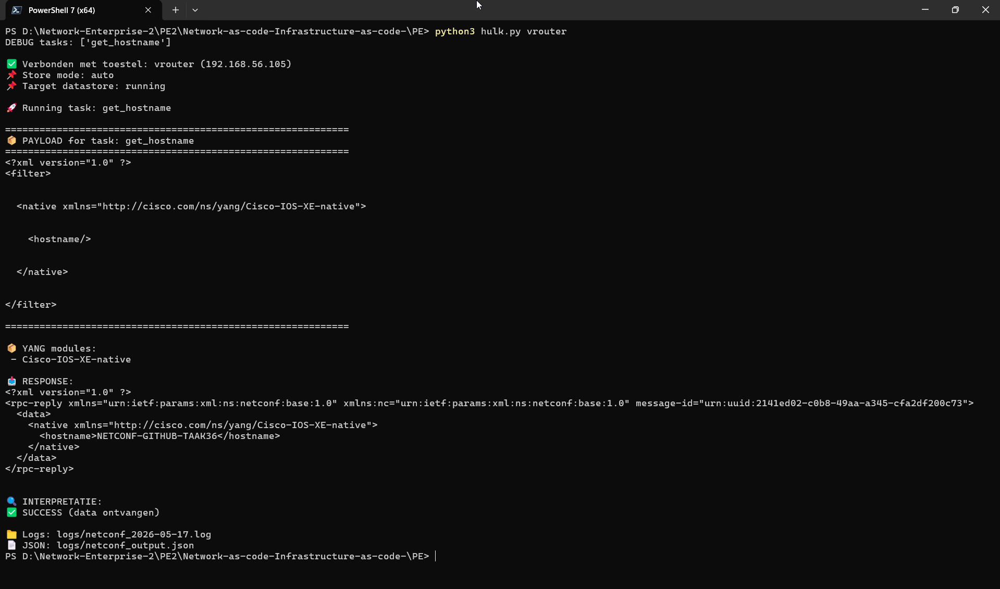
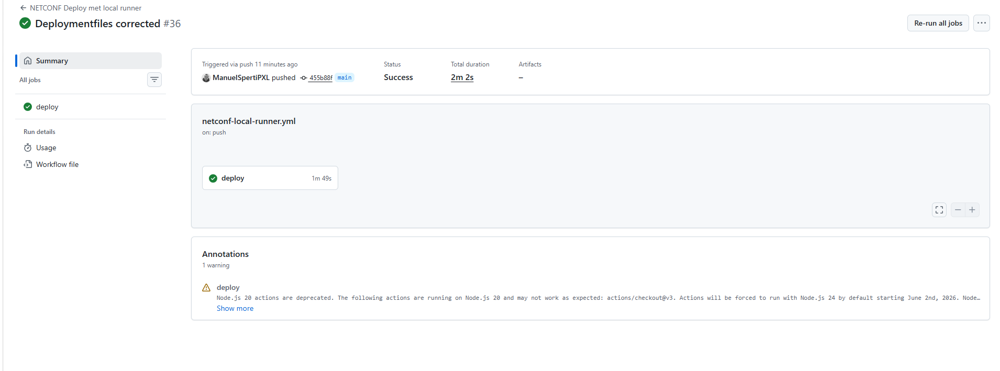
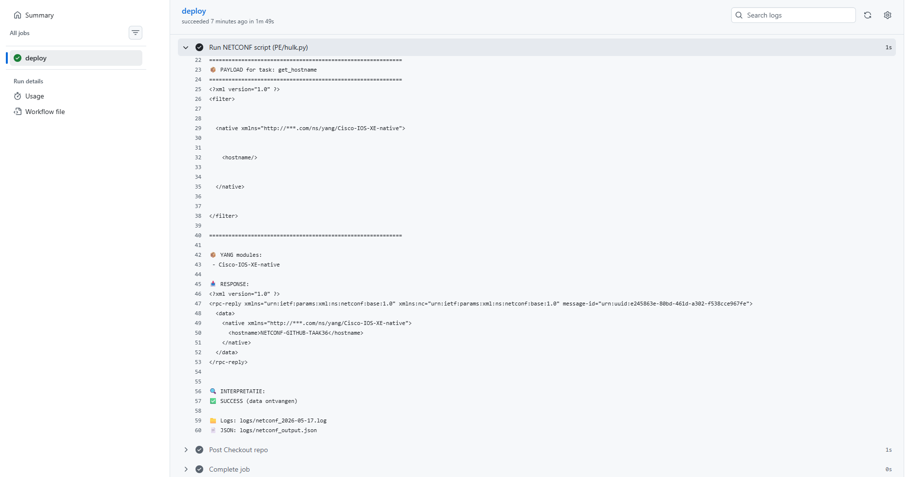

# 🟢 HULK v2.4 – NETCONF Task Executor

Een krachtige NETCONF automation tool geschreven in Python voor het uitvoeren van netwerkconfiguraties, validaties en monitoring via YANG-modellen.
Dit script automatiseert configuraties op netwerkapparaten (zoals Cisco IOS-XE) en biedt ondersteuning voor:

✅ Config push (edit-config) <br /> 
✅ Data retrieval (get / get-config)<br />
✅ Candidate / running datastore handling<br />
✅ Rollback & diff vergelijking<br />
✅ YANG-aware parsing<br />
✅ Logging (tekst + JSON)<br />
✅ Remote config ophalen via GitHub<br />


## 📦 Features
### 🔧 NETCONF Operaties

- GET → informatie ophalen van het toestel
- CONFIG → configuraties uitvoeren
- ROLLBACK → terug naar vorige config
- COMPARE → running vs candidate vergelijken
- CAPABILITIES → device capabilities tonen
- ACTION → RPC acties uitvoeren


### 📊 Logging & Monitoring

Logs worden opgeslagen in:

logs/netconf_<datum>.log
logs/netconf_output.json


JSON logging bevat:

timestamp
task naam
status (SUCCESS / ERROR / UNKNOWN)
details


### 📡 YANG ondersteuning

Extractie van gebruikte YANG modules uit XML
Overzicht van gebruikte namespaces
Debugging van payloads

## Voorbeeld payload

```xml
    <config>
      <native xmlns="http://cisco.com/ns/yang/Cisco-IOS-XE-native">
        <interface>
          <GigabitEthernet>
            <name>0/0/0</name>
            <description xmlns:nc="urn:ietf:params:xml:ns:netconf:base:1.0" nc:operation="merge">Geconfigureerd via netconf en python</description>
          </GigabitEthernet>
        </interface>
      </native>
    </config>
```


## Voorbeeld uitvoering (NETCONF)

Onderstaande screenshot toont een succesvolle uitvoering van een NETCONF get-operatie (hostname ophalen):



De RPC-reply toont dat de hostname correct werd opgehaald via het Cisco-IOS-XE-native YANG model. De status is succesvol (data ontvangen).

## CI/CD Deployment (GitHub Actions)

Onderstaande screenshots tonen een automatische NETCONF deployment via GitHub Actions.

Bij elke push naar de repository wordt een pipeline gestart die het Python-script uitvoert en configuraties toepast op het netwerktoestel.

### Pipeline overzicht


### Pipeline uitvoering (logs)

``
De pipeline voert volgende stappen uit:
- Repository ophalen (checkout)
- Dependencies installeren
- NETCONF script uitvoeren (Python)
- Payload versturen naar toestel
- Response verwerken en loggen

De logs tonen:
- gebruikte payload (XML via YANG model)
- RPC-reply van het toestel
- succesvolle interpretatie van de response

Dit demonstreert een volledige "Network as Code" workflow met CI/CD integratie.
``

### 🌐 GitHub Integratie

Haalt XML configuratie rechtstreeks op vanuit GitHub:

```shell
fetch_from_github()
```

📁 Projectstructuur

- hulk.py                       # hoofdscript (jouw code)
- tasks.py                      # task definities (XML payloads)
- filters.py                    # NETCONF filters
- netconf-hulk-requirements.txt # python requirements
- 36_end_to_end_config.xml      # toestel payload
- logs/
    - netconf_<date>.log
    - netconf_output.json
- screenshots/
    - get_hostname.png

### ⚙️ Vereisten
Python packages
Installeer dependencies:


```shell
pip install ncclient tabulate requests 
```

🔐 Environment Variables
Voor veiligheid worden credentials via environment variables geladen:
VRouter


```shell

export VROUTER_IP=192.168.x.x
export VROUTER_USER=username
export VROUTER_PASS=password

```

Lab Router
```shell
export LAB_ROUTER_IP=172.x.x.x
export LAB_ROUTER_USER=username
export LAB_ROUTER_PASS=password
```
Lab Switch
```shell

export LAB_SWITCH_IP=172.x.x.x
export LAB_SWITCH_USER=username
export LAB_SWITCH_PASS=password

```
▶️ Gebruik
Basis syntax

```shell
python main.py <device> <store_mode> <task1> <task2> ...
```
Voorbeelden
🔹 Hostname ophalen

```shell
python main.py vrouter auto get_hostname
```
🔹 Interface configureren

```shell
python main.py labrouter candidate task1 task2
```
🔹 Full deployment

```shell
python main.py vrouter candidate task36
```
🔹 Config ophalen van GitHub

```shell
python main.py vrouter running fetch_github
```

🧠 Store Modes

Mode                Beschrijving
auto                kiest automatisch (candidate indien beschikbaar)
candidate           gebruikt candidate datastore
running             schrijft direct naar running config


📋 Beschikbare Tasks
Tasks worden gedefinieerd in tasks.py.
Enkele voorbeelden:

## Task Beschrijving

task1       Interface description instellen
task2       Interface inschakelen (no shutdown)  
task3       IPv4 configuratie  
task4       IPv4 verwijderen  
task5       Loopback interface aanmaken  
task6       Loopback IPv4 configuratie  
task7       Hostname instellen  
task8       DNS configuratie  
task9       NTP configuratie  
task10      Static route configureren  
task11      Static route verwijderen  
task12      MOTD banner instellen  
task13      Lokale gebruiker aanmaken  
task14      User password aanpassen  
task15      VLAN aanmaken  
task16      VLAN interface configureren (SVI)  
task17      SNMP configuratie  
task18      Interface statistics ophalen (filter)  
task19      Running config ophalen  
task20      Configuratie valideren / aanpassen  
task21      Candidate datastore + commit  
task22      Datastore lock / unlock  
task23      Meerdere interfaces configureren (multi-RPC)  
task24      Specifieke actie op payload (script/logica)  
task25      Specifieke actie op payload (script/logica)  
task26      IPv6 configuratie  
task27      OSPF configuratie  
task28      Routing informatie ophalen (filter)  
task29      MTU configuratie  
task30      ACL configuratie + toepassen op interface  
task31      Speed / duplex instellen (niet werkend)  
task32      Clear counters (YANG action / RPC)  
task33      Capabilities ophalen / tonen (via script)  
task34      OpenConfig configuratie  
task35      Full deployment (gecombineerde configuratie)  
task36      End-to-end deployment  


Opmerking:
- Tasks 24 en 25 bevatten geen aparte payloads, maar voeren specifieke scriptlogica uit op bestaande configuraties of requests
- Filters voor operational data (tasks 18 en 28) zijn gedefinieerd in filters.py
- Payloads zijn geïntegreerd in Python functies i.p.v. aparte XML-bestanden
- Sommige configuraties zijn niet volledig werkend (task31)


🔍 Extra Functionaliteiten
📦 Payload visualisatie
Toont XML payload netjes geformatteerd:


```shell
📦 PAYLOAD for task: task1
```
🧬 YANG Module Detectie
Automatisch detectie van gebruikte YANG modules:

```shell

📦 YANG modules:
 - ietf-interfaces
 - cisco-ios-xe-native

```

🔎 Response Interpretatie
Automatische parsing van NETCONF responses:

✅ success (ok)
✅ data ontvangen
❌ RPC errors
⚠️ unknown responses

🔁 Rollback
Bij fouten kun je terug naar vorige config:

```shell
python main.py vrouter candidate task24
```
🔍 Config Compare
Vergelijkt running vs candidate:

```shell
python main.py vrouter candidate task2
```
Output:
```shell

- old config
+ new config

```

🛠️ Belangrijke Functies

Logging

```shell

log_to_file(message)
add_json_log(task, status, details)

```
NETCONF Response Parsing
```shell
interpret_netconf_response(response, task_name)
```
YANG Extractie

```shell
extract_yang_modules(xml_payload
```
Config Validatie
```shell
validate_change(m)
```
⚠️ Foutafhandeling
Het script detecteert automatisch:

❌ RPC errors <br >
❌ parsing errors <br >
❌ unsupported datastore <br >
❌ ontbrekende tasks <br >

✅ Best Practices

Gebruik environment variables (nooit hardcoded credentials)
Werk bij voorkeur met candidate datastore
Gebruik COMPARE voor veilige changes
Log altijd output voor troubleshooting

🚀 Toekomstige uitbreidingen

✅ Parallel execution van tasks <br >
✅ GUI frontend <br >
✅ REST API wrapper<br >
✅ Multi-device orchestration<br >
✅ Ansible integratie<br >


👨‍💻 Auteur
Manuel Sperti
Network Automation / Infrastructure as Code


🔄 Flow Diagram (Mermaid)

```Mermaid
flowchart TD

A[Start script] --> B[Lees CLI args]
B --> C[Select device + env vars]
C --> D[Maak NETCONF connectie]

D --> E[Bepaal datastore mode]
E --> F[Loop door tasks]

F --> G{Task type?}

G -->|GET| H["Run m.get()"]
G -->|CONFIG| I[Backup running config]
I --> J{Candidate supported?}

J -->|Yes| K[Lock candidate]
K --> L[edit-config]
L --> M[validate + commit]
M --> N[unlock]

J -->|No| O[edit-config -> running]

G -->|CAPABILITIES| P[Print capabilities]
G -->|ROLLBACK| Q[Restore backup]
G -->|COMPARE| R[Diff running vs candidate]
G -->|ACTION| S[Execute RPC dispatch]

H --> T[Print response]
N --> T
O --> T
P --> F
Q --> F
R --> F
S --> T

T --> U[Interpret response]
U --> F

F --> V{Meer tasks?}
V -->|Yes| F
V -->|No| W[Save JSON logs]

W --> X[End]
```